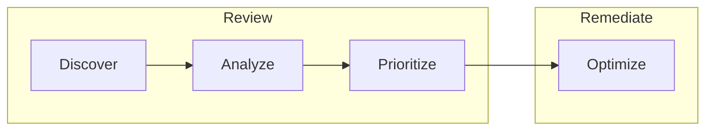
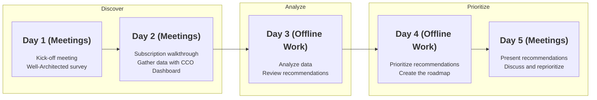

# Well-Architected processes and tools for ISV and self-serve guide

> ⚠️**Work in progress** \
This guide is still incomplete, but is based on the information you will find in the [Workshop][waf-workshop].

The Well-Architected Framework contains a set of processes and tools to help customers review and enhance their workloads on Azure. You can find a detailed explanation on how to use the framework in the [Well-Architected Workshop][waf-workshop].

This guide is intended to provide you with a step-by-step process to review the architecture of your own workload, and build a roadmap with the recommendations you will get after running the assessment.

In the Well-Architected framework process we define four phases:

1. **Discover**: in this step you collect the relevant information and assess the
workload, describe the current architecture and document the needs and
objections of the customer.
2. **Analyze**: assess mutual dependencies and trade-offs and document your
recommendations, considering each of the WAF pillars.
3. **Prioritize**: weigh the impact of the recommendations and idenify the
optimal schedule.
4. **Optimize**: this belongs to the remediation phase where you will review,
fix, test and validate the recommendations. You should not forget to backup,
communicate, test and document everything.

In this guide we will focus on the three first phases belonging to the Review subset.

## Prerequisites

If you did not receive any training about Well-Architected Framework, you need first to take one of these two trainings:

* [Well-Architected training for partners][partner-training]
* [Well-Architected leaning path in Microsoft Docs][docs-training]

After this, check the next points: select your workload, define the scope and people and resources.

### Select the workload

You should have already seen in the [Well-Architected Introduction][waf-introduction] and [Workshop][waf-workshop] that we are going to work over a specific workload. So the first step is to define which workload we are going to review and gather some basic information about it. You may already know everything about your workload, but take the time to document it so anyone can have this information in the same place.

| **Field** | **Description** |
| --- | --- |
| **Name** | The actual name for your workload|
| **Description** | A short description of your workload in three paragraphs: · The business case it adresses · The technology it is using · The team and resources it needs |

### Determine the assessment motion

Once you have identified the target workload, you should determine if the scenario is suitable for the **Go-Live assessment motion**. If it is, you may want to use the Well-Architected Go-Live assessment instead of the Well-Architected "Core" assessment referenced in this guide.

You can use the following questions about the workload to help you determine the assessment motion.

* Is the architecture that you are being asked to assess in production already? 
  * A solution may already be in production but you may want to assess a significant change/update to that solution.
* Do they have specific concerns about the workload? (e.g. its cost, performance, etc.)
* Would you class the workload as a particularly specialized scenario (e.g. IoT) or does it have numerous/specialized IaaS components (e.g. SAP HANA) or hybrid components? (e.g. multi-cloud) 

If the answer to all of the three questions is "No", then the Well-Architected Go-Live assessment may be a good option.

Well-Architected Go-Live is positioned as a "go forward" assessment that is used to review a change that is not yet in production or has just gone into production.
* It works best for cloud native workloads. (using mostly PaaS components like App Service or SQL DB) 
* It is a cross-pillar offering and helps identify any major risks or concerns that should be addressed before "going live". 

If you decide to deliver a Go-Live assessment, continue with the [Go-Live assessment guide][go-live].
Otherwise continue to the next step.
> 🆘 If you are still unsure, continue with the Core Well-Architected assessment in this article.

### Define the Scope

Doing the complete assessment of your workload can be a long process and take a long time. So, it is better to restrain the scope for your assessment to focus on the most important areas aligned with your current business needs.

As a general rule, **pick at most three** of the five pillars of the Well-Architected Framework:

- [x] Cost optimization
- [ ] Performance Efficiency
- [ ] Reliability
- [ ] Operational Excellence
- [x] Security

> 🆘 If you are not sure, start with the Cost Optimization one. It will have an easily measurable impact in terms of savings, and the budget margin you will gain could serve to enhance the other pillars afterward. Another good one to start with is the Security one.

### People and resources

Architecture is designed by people, and during the assessment you will need to review the motivations of some architectural decisions. You need to identify the people and resources that were involved in the current design. The people who own, use, operate and monitor the current deployment are also important in these meetings.

You will also need a read-only access to the workload resources on Azure, to connect the tools to gather the information you need.

Here's a checklist of what you need before starting the assessment:

- [ ] List of the people who will be involved in the assessment
- [ ] Account with read access to the workload's subscription
- [ ] Architecture diagrams of the current workload
- [ ] If available, the roadmap for the next version
- [ ] Prepare and block the meetings with all the people involved
  - [ ] First two days with the owner and architects
  - [ ] Third and fourth days to analyze the results and write-down the recommendations
  - [ ] Fifth day to present the results to everyone and agree on the next steps

## Select the type of Assessment you want to do

There are two ways of running the assessment:

* **Fast assessment**: this one is executed with a set of automatic tools to extract the information and to provide you with a quick overview of the assessment results in two simple steps:
    1. You will fill the [Well-Architected Review][waf-review] connected to your Azure Advisor.
    2. Once the assessment is done, you will export the results and create a recommendation report using the [Well-Architected Tools][warp]
* **In-depth assessment**: you will follow the steps of this guide to gather all the needed information and to analyze in-depth every aspect of your architecture in regards to each pillar of the Well-Architected Framework.

## In-depth Well-Architected Assessment

The full Well-Architected assessment process will take more time, but will also provide much more value, it will be more accurate and meaningful.

### Define the Rhythm of the Architecture Review

Establish the rhythm of the architecture review and plan each day. Here's an example:

---

### Start with the assessment

Now that you have all the prerequisites, you can start with the assessment. But first, let's review again that you have all the information:

* [ ] The Workload is defined
* [ ] The scope of the assessment is clear
* [ ] You have access to the resources in Azure
* [ ] You have prepared the agenda and the meetings

---

All right, let's [start with the review][1]. If you came back here but you have already started, continue in any of these steps:

* Discover
  * [Workload mind map][1]
  * [Information collection][2]
* [Analyze][3]
  * [Cost Optimization][3.A]
  * [Security][3.B]
  * [Reliability][3.C]
  * [Performance Efficiency][3.D]
  * [Operational Excellence][3.E]
* Prioritize
  * [Priority Matrix][4]
  * [Write the roadmap][5]
* [Present the results][6]

[1]: ./steps/01.Workload.md
[2]: ./steps/02.Collection.md
[3]: ./steps/03.Analyze
[3.A]: ./steps/03.A.CostOptimization.md
[3.B]: ./steps/03.B.Security.md
[3.C]: ./steps/03.C.Reliability.md
[3.D]: ./steps/03.D.Performance.md
[3.E]: ./steps/03.E.Operations.md
[4]: ./steps/04.Prioritize.md
[5]: ./steps/05.Roadmap
[6]: ./steps/06.Finalize.md

[waf-introduction]: ../0.%20Well-Architected%20Introduction
[go-live]: ./go-live
[waf-review]: https://docs.microsoft.com/en-us/assessments/
[waf-workshop]: ../1.%20Well-Architected%20Workshop
[warp]: https://github.com/Azure/WellArchitected-Tools/tree/main/WARP/devops#reporting

[partner-training]: https://www.microsoft.com/azure/partners/well-architected
[docs-training]: https://docs.microsoft.com/en-us/learn/paths/azure-well-architected-framework/
