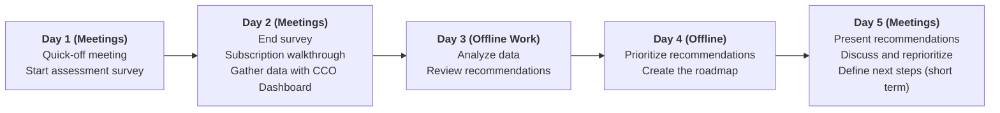

# Well-Architected processes and tools for ISV and self-serve guide

> Work in progress

The Well-Architected Framework contains a set of processes and tools to help customers review and enhance their workloads on Azure. You can find a detailed explanation on how to use the framework in the [Well-Architected Workshop][waf-workshop].

This guide is intended to provide you with a step-by-step process to review the architecture of your own workload, and build a roadmap with the recommendations you will get after running the assessment.

## Prerequisites

### Select the workload

You should have already seen in the [Well-Architected Introduction][waf-introduction] and [Workshop][waf-workshop] that we are going to work over a specific workload.So the first step is to define which workload we are going to review and gather some basic information about it. You may already know everything about your workload, but take the time to document it so anyone can have this information in the same place.

| **Field** | **Description** |
| --- | --- |
| **Name** | The actual name for your workload|
| **Description** | A short description of your workload in three paragraphs: * The business case it adresses * The technology it is using * The team and resources it needs |

### Define Scope

Doing a complete assessment of your workload can be a long process and takes a long time. So it is better to define a scope for your assessment to focus on the most important areas aligned with your current business needs.Select between one and , at most, three of the five-pillars of the Well-Architected Framework:

- [ ] Cost optimization
- [ ] Performance Efficiency
- [ ] Reliability
- [ ] Operational Excellence
- [ ] Security

> Do not worry if you feel you need to pick them all, the assessment will provide you with some recommendations in other pillars even if you only choose one. If you are not sure, try to focus on the ones that you think will have a greater impact in the short term.

### People and resources

Architecture is designed by people, and during the assessment you will need to review the motivations of some architectural decissions, so you need to identify the people and resources that were involved in the current design, and also other important profiles who own, use, operate and monitor the current deployment. 

You will also need at least read-only access to the workload resources on Azure, to connect some tools to gather important information. So come with these list with all checked:

- [ ] List of the people who will be involved in the assessment
- [ ] Account with read access to the workload's subscription
- [ ] Architecture diagrams of the current workload
- [ ] If available, the roadmap for the next version
- [ ] Prepare and block the meetings with all the people involved
    - [ ] First two days with the owner and architects
    - [ ] Third and fourth days to analyze the results and write-down the recommendations
    - [ ] Fifth day to present the results to everyone and agree on the next steps

### Define the Rhythm of the Architecture Review

Establish the rhythm of the architecture review and plan each day. Here's an example:

## Start with the assessment

Now that you have all the prerequisites, you can start with the assessment. But first, let's review the information you have:

- [ ] Selected Workload
- [ ] Scope of the assessment
- [ ] Access to the resources
- [ ] Meetings prepared

All right, let's [start with the review][start]. If you came back here but you have already started, continue in any of these steps:

* [Workload mind map][start]
* Information collection
    * Well-Architected Assessment
    * CCO Dashboard
* Review the recommendations
    * Cost Optimization
    * Security
    * Reliability
    * Performance Efficiency
    * Operational Excellence
* Prioritize the recommendations
* Write the roadmap
* Present the results

[start]: ./steps/01.Workload.md

[waf-introduction]: ../0.%20Well-Architected%20Introduction
[waf-workshop]: ../1.%20Well-Architected%20Workshop
