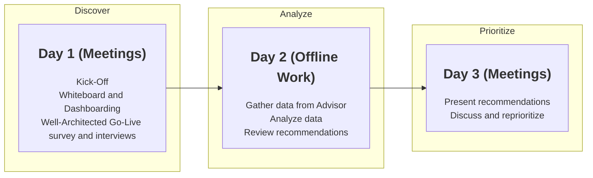

# Well-Architected Go-Live processes and tools for ISV and self-serve guide

The Well-Architected Framework contains a set of processes and tools to help customers review and enhance their workloads on Azure. You can find a detailed explanation on how to use the framework in the [Well-Architected Workshop][waf-workshop].

This guide is intended to provide you with a step-by-step process to review the architecture of a workload in a "go forward" motion. 

Well-Architected Go-Live is designed to review cloud-native workloads. These are workloads that primarily consist of PaaS services such as Azure App Service or Azure Cosmos DB. 

The assessment is a cross-pillar offering and helps identify any major risks or concerns that a team should address. It reaches across the five Well-Architected pillars.

## Prerequisites

Please review the resources and review introduction set out in the guide for the ["Core" Well-Architected assessment](./README.md).

## Select the workload
If you have not done so already, please review the [Well-Architected Introduction][waf-introduction] and [Workshop][waf-workshop] content which will introduce you to the concept of a workload. The Well-Architected Go-Live assessment is run on one specific workload at a time.

## Ensure Go-Live is the right choice of assessment
Review the below bullet points to assess if your workload is a good match for the Go-Live assessment. If you find that none or only a few of the descriptions apply, continue with the ["Core" Well-Architected assessment](./README.md) instead.

- Go-Live is aimed at workloads that are considered cloud-native and are primarily made up of Platform as a Service offerings (for example: App Service, Azure Kubernetes Service, SQL DB, Cosmos)
   - The list of supported services changes frequently and the easiest way to review what is and isn't supported is via the assessment on [aka.ms/assessments](https://aka.ms/assessments). The initial three questions offer a comprehensive set of supported services.
- Go-Live works well for workloads that are about to go into production or have just gone into production
- Go-Live can be used to review planned architectural changes to an existing solution
- Go-Live is an assessment that incorporates aspects of all five Well-Architected pillars. As a result it might not touch as deeply on each individual pillar, but might be a good starting point to identify further assessment and education opportunities.

## People and Resources
During the assessment you will need to review the motivations of some architectural decisions. Getting a deep understanding of the architecture from the people who built it is essential to delivering a successful Go-Live assessment. You should also involve the operations and development teams for the solution if they are different from the people designing the architecture.

It is strongly recommended that you gain read-only access to the workload in Azure. This will allow you to review Azure Advisor as well as see the deployment in action. If the workload is not in production yet, you can instead request access to a pre-release environment. 

Below is a checklist of the requirements: 
* [ ] List of the people who will be involved in the assessment
* [ ] (highly recommended) Read-only access to the Azure subscription that hosts the workload (or a pre-release version of it)
* [ ] Architecture diagrams of the current workload
* [ ] (if available/applicable) details of the planned changes to the workload

When delivering an in-depth assessment, you should set up meetings with all key stakeholders to discuss the solution in detail. 

# Delivery Format

## Select the assessment type

There are two ways of running the assessment. 

* **Fast assessment:** this one is executed with a set of automatic tools to extract the information and to provide you with a quick overview of the assessment results in two simple steps:
  * You will fill the Well-Architected Review and gather insights from Azure Advisor.
  * Once the assessment is done, you will export the results and create a recommendation report using the Well-Architected Tools
* **In-depth assessment:** you will follow the steps of this guide to gather all the needed information and to analyze in-depth every aspect of your architecture in regards to each pillar of the Well-Architected Framework.

## In-depth assessment

Below is an example of a format that the delivery might take.

| **Day / Time** | **Description** |
| --- | --- |
| **Day 1 / AM** | Whiteboarding of the workload with the architecture team including a review of all components.|
| **Day 1 / PM** | Interviews with the operations and development teams to better understand their concerns and involvement with the architecture.|
| **Day 2 / AM** | Review of the workload on Azure in pre-production including a review of Azure Advisor.|
| **Day 2 / PM** | Completion of the survey. (either as a group or separately)|
| **Day 3 / AM** | Reporting and result collection.|
| **Day 3 / PM** | Presentation of the results. Prioritization of the remediation activity.|

You should set up meetings and calendar blockers for everyone involved so that they can make sure that they are available for all necessary interviews, whiteboarding sessions, and report read outs. 

# Information Collection

You will use the Well-Architected Go-Live assessment survey on [aka.ms/assessments](https://aka.ms/assessments) as your core assessment questionnaire. 

Please also review the information collection [tools](2) provided as part of the "Core" Well-Architected assessment guide.

If the workload is already deployed in a pre-release subscription you may leverage [Azure Advisor](https://docs.microsoft.com/azure/advisor/advisor-get-started) and [App Service Diagnostics](https://docs.microsoft.com/en-us/azure/app-service/overview-diagnostics) to further enhance the delivery by gather additional recommendations from these tools.

# Reporting

The Go-Live assessment is supported by a version of the [same reporting tools](https://github.com/Azure/WellArchitected-Tools/tree/main/WARP/devops/Go-Live) used in the "Core" Well-Architected assessment. 
They are located in their own folder in the *WellArchitected-Tools* repo linked above. 

The report generation script operates in largely the same way as the one for the "Core" Well-Architected assessments. You need to run it using the "-AssessmentType Go-Live" option, so that the right PowerPoint template is used.
Advisor or App Service Diagnostics recommendations are not automatically integrated, so you may need to adjust your reporting templates as needed. It is highly recommended to review both tools with the customer as part of the information gathering and interviews conducted in a Go-Live assessment.

Please review the report generation script for instructions on how to use it.
As well as completing the survey you should critically evaluate the information collected during whiteboarding and the interviews. Please reference the core aspects explored in the different pillar sections in the context of the assessment. 

  * [Cost Optimization][3]
  * [Security][3.B]
  * [Reliability][3.C]
  * [Performance Efficiency][3.D]
  * [Operational Excellence][3.E]

The Go-Live report comes with general priorities, but the specific context of the workload might mean that you need to update these priorities. You should also spend some time applying the concept of the [Priority Matrix][4] to work out what recommendations constitute deployment blockers, high risk issues that should be prioritized, and lower risk recommendations that can be implemented eventually. 

Reference the content in ["Write the roadmap"][5] as part of your reporting on the Go-Live assessment. 

# Finalize

The in-depth assessment ends with a close out presentation where you present both the high-level findings and your reporting. 
It's an opportunity to discuss follow-up remediation activities. 

These activities may include:
- Further education to build a better understanding of the components involved in the workload
- Remediation activity on the workload to reduce critical risks
- Process changes to better support the workload as it moves to production

[1]: ./steps/01.Workload.md
[2]: ./steps/02.Collection.md
[3]: ./steps/03.A.CostOptimization.md
[3.B]: ./steps/03.B.Security.md
[3.C]: ./steps/03.C.Reliability.md
[3.D]: ./steps/03.D.Performance.md
[3.E]: ./steps/03.E.Operations.md
[4]: ./steps/04.Prioritize.md
[5]: ./steps/05.Roadmap
[6]: ./steps/06.Finalize.md

[waf-introduction]: ../0.%20Well-Architected%20Introduction
[waf-review]: https://docs.microsoft.com/en-us/assessments/
[waf-workshop]: ../1.%20Well-Architected%20Workshop
[warp]: https://github.com/Azure/WellArchitected-Tools/tree/main/WARP/devops#reporting

[partner-training]: https://www.microsoft.com/azure/partners/well-architected
[docs-training]: https://docs.microsoft.com/en-us/learn/paths/azure-well-architected-framework/
