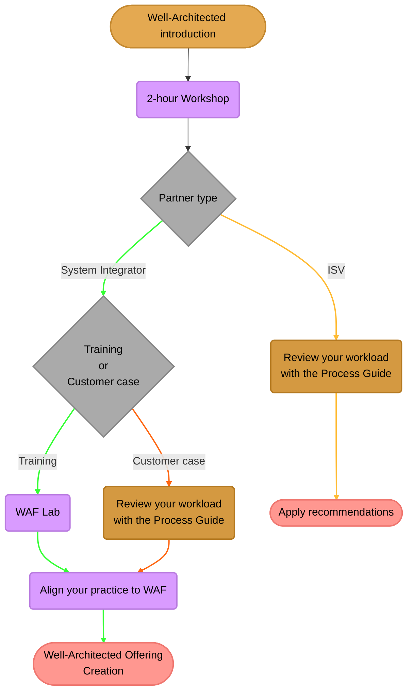

# The Well-Architected Training for partners

## Why do you need Well-Architected and why it matters

Running an architecture review after an incident is a very important tool to understand why it happened, but it may be too late because it could have already generated unexpected costs, business losses, a data breach, customer churn, loss of revenue or many other problems.

This is why we recommend conducting regular architecture reviews, to ensure that your workload is using the architecture characteristics that fit your business needs and concerns and are among the up-to-date industry best practices, because...

* You want to be confident that you pay for what you really need for your business and ensure that you have the tools and processes in place to detect, control and manage outlier costs in the case of an incident.
* You need to know how resilient is your workload to failures and that you can recover all your systems and data in a specific amount of time.
* It is important that your solution provides a good performance to its users, so they can do their tasks on time without any hassle, and that you are in control that it does not degrade over time.
* Operational costs should be under control, and you need to ensure that your solution is tested and monitored all the time.
* You have to assume zero trust and have to be confident that your solution is designed for security.
* You should take into consideration all the trade-offs for the architecture decisions.

The Well-Architected framework will provide you with a process and the tools to transform all these needs into a list of **actionable recommendations**.

## Training process and contents

This repository contains the public training materials for the Well-Architected Framework Training for partners. It is structured as follows:

1. [Well-Architected Framework Introduction][WAF-Intro]
2. The [Well-Architected Workshop][WAF-Workshop] to learn the basics
3. Here the plan splits betwen SIs and ISVs:
    * When you are a **System Integrator** and you want to use the framework to create or align a practice you can take the following steps:
        1. You have two options:
            * The [Well-Architected Lab][WAF-Lab] for getting hands-on experience with a ficticius customer-case
            * If you already have a customer case where you want to work on, you can use the [Well-Architected Process Guide][WAF-Process-Guide] where you have a guided step-by-step to do an assessment and provide recommendations to your customer.
        2. The [Well-Architected Offering][WAF-Offering] to learn how to create a new offering in the Azure Marketplace
    * For **ISVs** we have prepared a step-by-step guide to help you review your own workload:
        1. The [Well-Architected Process Guide][WAF-Process-Guide] that explain the full WAF process
        2. The [Go-Live assessment][go-live] used to review a change that is not yet in production or has just gone into production.

## Description

The [Well-Architected Framework][WAF-Intro] is a well-defined process for
running architecture reviews and provide your customers a consistent list of
recommendations for enhancing their workloads in Azure.

These materials can be used standalone, but they are intended to be used in a training run by the GPS team in Microsoft. Ask your Microsoft representative if there is any Well-Architected event in your region that you would like to attend.

### [Well-Architected Introduction][WAF-Intro]

This is a standard level 100 introduction to the Well-Architected Framework. It explain the motivations behind the framework and how it is used. After reading or watching this introduction, it is recommended to follow one of these trainings to get the most out of this guides:

* [Well-Architected training for partners][partner-training]
* [Well-Architected leaning path in Microsoft Docs][docs-training]

### [Well-Architected Workshop][WAF-Workshop]

This is a 2-hour presentation usually delivered by a Cloud Solution Architect to a group of architects or pre-sales engineers. It explains what is the Well-Architected Framework, why it is useful, how is the process of a Well-Architected assessment and goes deep into the 5 pillars of Well-Architected.

You will get a deep explanation about what are the most important questions to ask and what tools you can use to gather all the data you need.

### [Well-Architected Lab][WAF-Lab]

After having attended a [WAF Workshop][WAF-Workshop], the next step is to attend this event where you will get hands-on experience with the Well-Architected Framework.
It is a 1-day lab, where you will be given a customer case and you will do a group exercise to run the Well-Architected process, and create the reports and planning documents to present to the customers with a selection of recommendations that you will have to prioritize.

Ask your local PTS/PDM in Microsoft GPS organization for getting info about upcoming workshops.

### [Well-Architected Process Guide][WAF-Process-Guide]

This is a step-by-step guide to help you run a Well-Architected assessment and provide recommendations to a workload. It can be used by both System Integrators and ISVs.

### [Go-Live assessment][go-live]

Well-Architected Go-Live is positioned as a "go forward" assessment that is used to review a change that is not yet in production or has just gone into production.
* It works best for cloud native workloads. (using mostly PaaS components like App Service or SQL DB) 
* It is a cross-pillar offering and helps identify any major risks or concerns that should be addressed before "going live".

### [Well-Architected Offering][WAF-Offering]

As a Microsoft Partner you want to create new services offers in the Azure Marketplace. You can use the [Well-Architected Offering][WAF-Offering] to learn how to create a new offering in the Azure Marketplace.

## License

This project is licensed under the [MIT license](LICENSE).

> **Trademarks** This project may contain trademarks or logos for projects, products, or services. Authorized use of Microsoft trademarks or logos is subject to and must follow [Microsoft’s Trademark & Brand Guidelines](https://www.microsoft.com/en-us/legal/intellectualproperty/trademarks/usage/general). Use of Microsoft trademarks or logos in modified versions of this project must not cause confusion or imply Microsoft sponsorship. Any use of third-party trademarks or logos are subject to those third-party’s policies.

[WAF-Intro]: https://github.com/microsoft/GPS-Well-Architected-Partner-Training/tree/main/0.%20Well-Architected%20Introduction
[WAF-Workshop]: ./1.%20Well-Architected%20Workshop
[WAF-Lab]: ./2.%20Well-Architected%201%20day%20lab
[WAF-Offering]: ./3.%20Well-Architected%20Offering
[WAF-Process-Guide]: ./2.b%20Well-Architected%20Process%20Guide
[WAF_training_process]: ./WAF_training_process.svg "The Well-Architected training explained"
[partner-training]: https://www.microsoft.com/azure/partners/well-architected
[docs-training]: https://docs.microsoft.com/en-us/learn/paths/azure-well-architected-framework/
[go-live]: ./2.b%20Well-Architected%20Process%20Guide/steps/go-live
